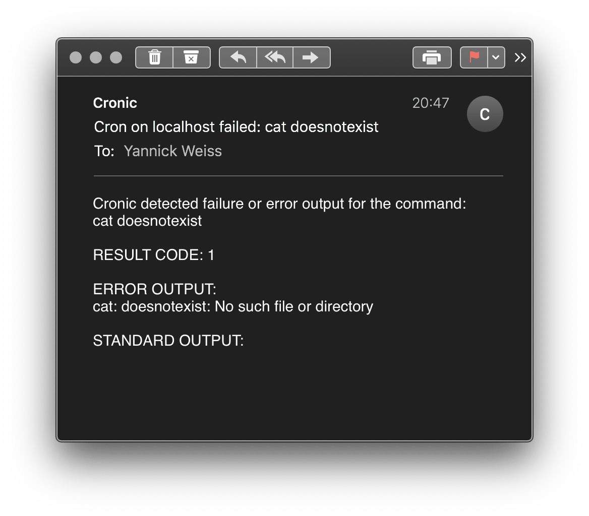

# cronic

> Send crontab results per email.

`cronic` runs the given command and sends errors per mail.


From `0 1 * * * backup_cmd >/dev/null 2>&1`

To   `0 1 * * * cronic backup_cmd`




## Configuration
You can specify a config file, `.env` file or ENV variables (in this order).
Default config location is `~/.config/cronic/cronic.conf`, can be changed with `-c`.

```bash
mkdir -p ~/.config/cronic/
cp cronic.conf ~/.config/cronic/cronic.conf
vim ~/.config/cronic/cronic.conf

# or set new path with -c the order is important!
./cronic -c ./path/cronic.conf echo "hello world"

# validate SMTP config with
./cronic validate
```
## Sending Email on error and success
If you configure `sendstdout=true` in cronic.conf it also sends a mail on success.
The exit code is passed through.

## Modifying Subject and Boady Template
Adjust the template with what the problem could be and possible next steps.

Example on how to change them:
```toml
[smtp]
host="smtp.office365.com"
port=587
username="error@example.org"
password="..."
encryption="TLS"
authentication="Login"
[mail]
sender="error@example.org"
receiver="itteam@example.org"
subject="Backup Job Failed"
template="""
If this happens please check cronjob X on machine Y

RESULT CODE: {{.ResultCode}}

ERROR OUTPUT:
{{.ErrorOutput}}

STANDARD OUTPUT:
{{.StandardOutput}}
"""

```

## Features and Todo
- [x] Send stderr per mail
- [x] Consume TOML config
- [x] Take path to config from flag
- [x] Option for TLS/SSL/none
- [x] Option to always send stdout
- [x] Forward stdout/stderr to parent
- [x] Inform if a script is not executable (chmod +x)

## Notes on smtp.office365.com
Username and sender has to be equal.
The connection uses Encryption TLS and Authentication Login.

## Inspiration
* https://habilis.net/cronic/

## Dependencies
* github.com/xhit/go-simple-mail
* github.com/naoina/toml
